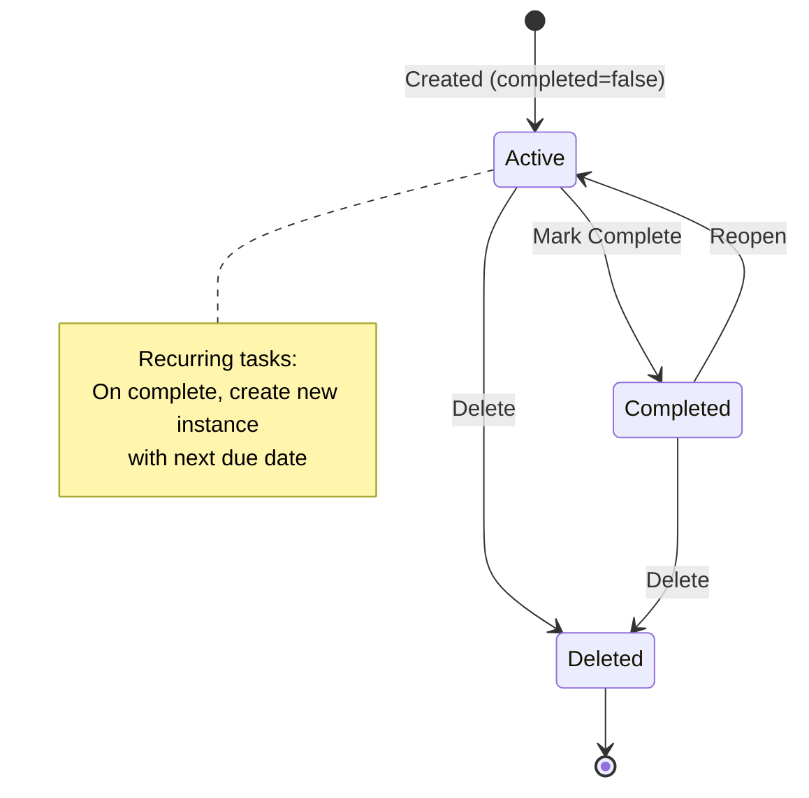
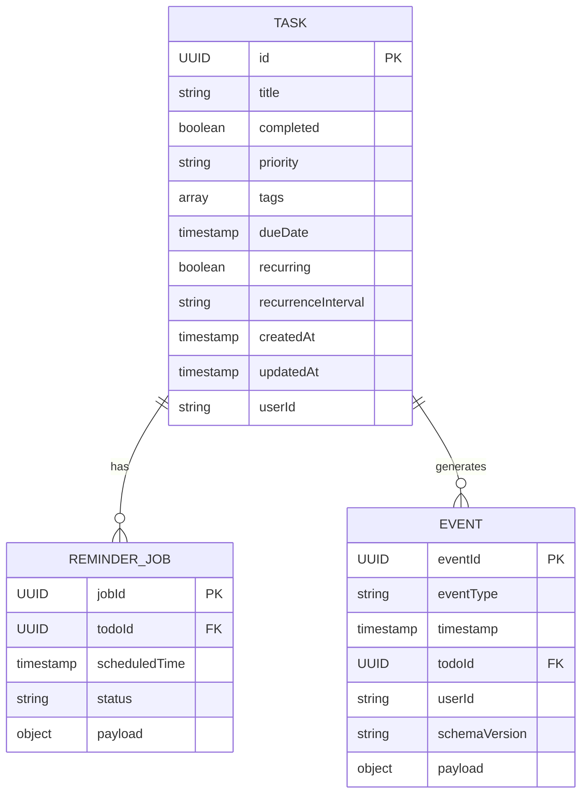

# Data Model: Event-Driven Todo Application

**Date**: 2026-01-27
**Phase**: Phase 1 - Design & Contracts
**Status**: Complete

## Overview

This document defines the domain entities, data structures, and relationships for the Event-Driven Todo Application. All entities are stored via Dapr State Store API (Redis backend) and communicated via events on Kafka topics.

---

## Domain Entities

### Task

**Purpose**: Represents a todo item with extended attributes for Phase V features (priorities, tags, due dates, recurring tasks)

**Storage**: Dapr State Store (key: `task:{uuid}`)

**Attributes**:

| Attribute | Type | Constraints | Default | Description |
|-----------|------|-------------|---------|-------------|
| `id` | UUID | Required, immutable | Auto-generated | Unique task identifier |
| `title` | string | Required, 1-200 chars | - | Task title/summary |
| `description` | string | Optional, max 2000 chars | empty string | Detailed description |
| `completed` | boolean | Required | `false` | Completion status |
| `priority` | enum | One of: High, Medium, Low | `Medium` | Task priority level |
| `tags` | array[string] | Max 50 tags, each max 50 chars | `[]` | Custom classification tags |
| `dueDate` | ISO8601 timestamp | Optional, must be future | `null` | Task deadline |
| `recurring` | boolean | Required | `false` | Whether task recurs |
| `recurrenceInterval` | enum | One of: daily, weekly, monthly | `null` | Recurrence pattern |
| `createdAt` | ISO8601 timestamp | Required, immutable | Auto-generated | Creation timestamp (UTC) |
| `updatedAt` | ISO8601 timestamp | Required, auto-updated | Auto-generated | Last modification timestamp (UTC) |
| `userId` | string | Required, immutable | From auth context | Owner user identifier |

**Validation Rules**:
1. `title` must not be empty or whitespace-only
2. `tags` must be unique within task (no duplicates)
3. `dueDate`, if set, must be in the future (validated at creation/update time)
4. `recurrenceInterval` is required if `recurring=true`, otherwise must be `null`
5. Maximum 50 tags per task (enforced by API)
6. `userId` must match authenticated user (authorization check)

**State Transitions**:



**State Rules**:
- **Active**: `completed=false`, task visible in active lists
- **Completed**: `completed=true`, task visible in completed lists
- **Deleted**: Removed from State Store, only exists in event history

**Example (JSON)**:
```json
{
  "id": "550e8400-e29b-41d4-a716-446655440000",
  "title": "Review Phase V specification",
  "description": "Validate event-driven architecture design and Dapr component configurations",
  "completed": false,
  "priority": "High",
  "tags": ["architecture", "review", "phase-v"],
  "dueDate": "2026-01-28T17:00:00Z",
  "recurring": false,
  "recurrenceInterval": null,
  "createdAt": "2026-01-27T10:00:00Z",
  "updatedAt": "2026-01-27T10:00:00Z",
  "userId": "user-123"
}
```

---

### ReminderJob

**Purpose**: Represents a scheduled reminder for task due dates, managed via Dapr Jobs API

**Storage**: Dapr Jobs API internal state (not directly in State Store)

**Attributes**:

| Attribute | Type | Constraints | Description |
|-----------|------|-------------|-------------|
| `jobId` | UUID | Required, unique | Dapr job identifier (format: `reminder-{todoId}`) |
| `todoId` | UUID | Required, foreign key | References Task.id |
| `scheduledTime` | ISO8601 timestamp | Required, future | When reminder should fire |
| `status` | enum | One of: pending, executed, cancelled | Job execution status |
| `payload` | object | Required | Job metadata (todoId, userId, title) |

**Lifecycle**:
1. **Created**: When task is created/updated with `dueDate` set
   - Scheduled time: `dueDate - 24 hours` (configurable)
2. **Executed**: When scheduled time reached, publishes `todo-reminder` event
3. **Cancelled**: When task completed, deleted, or `dueDate` removed/changed
4. **Rescheduled**: When `dueDate` updated to new value

**Dapr Jobs API Integration**:
```json
{
  "job": {
    "name": "reminder-550e8400-e29b-41d4-a716-446655440000",
    "schedule": "@once 2026-01-27T17:00:00Z",
    "data": {
      "todoId": "550e8400-e29b-41d4-a716-446655440000",
      "userId": "user-123",
      "title": "Review Phase V specification"
    }
  }
}
```

**State Management**:
- Job creation/cancellation handled by backend service
- Dapr Jobs API persists job state internally
- No direct State Store usage for ReminderJob

---

### Event

**Purpose**: Domain event for event-driven communication via Kafka topics

**Storage**: Kafka topics (transient, 7-day retention)

**Attributes**:

| Attribute | Type | Constraints | Description |
|-----------|------|-------------|-------------|
| `eventId` | UUID | Required, unique | Deduplication key (idempotency) |
| `eventType` | enum | One of: todo-created, todo-updated, todo-deleted, todo-reminder | Event discriminator |
| `timestamp` | ISO8601 timestamp | Required | Event occurrence time (UTC) |
| `todoId` | UUID | Required | Task identifier (partition key) |
| `userId` | string | Required | User who triggered event |
| `schemaVersion` | string | Required | Event schema version (default: "1.0") |
| `payload` | object | Required | Event-specific data |

**Event Types**:

1. **todo-created**:
   - Published when: New task created via API
   - Payload: Full task object
   - Consumers: Backend (state store write), future analytics service

2. **todo-updated**:
   - Published when: Task attributes modified (title, description, priority, tags, dueDate, etc.)
   - Payload: Full task object (after update)
   - Consumers: Backend (state store update), future real-time sync service

3. **todo-deleted**:
   - Published when: Task deleted via API
   - Payload: Task ID only (task already removed from state)
   - Consumers: Backend (cleanup reminder jobs), future audit service

4. **todo-reminder**:
   - Published when: Scheduled reminder job fires (Dapr Jobs API)
   - Payload: Task ID, title, due date
   - Consumers: Backend (notification service - future), frontend (UI notifications - future)

**CloudEvents Envelope** (Dapr Pub/Sub standard):
```json
{
  "specversion": "1.0",
  "type": "com.todoapp.todo-created",
  "source": "backend",
  "id": "550e8400-e29b-41d4-a716-446655440000",
  "time": "2026-01-27T10:00:00Z",
  "datacontenttype": "application/json",
  "subject": "550e8400-e29b-41d4-a716-446655440000",  // todoId (partition key)
  "data": {
    "eventId": "550e8400-e29b-41d4-a716-446655440000",
    "eventType": "todo-created",
    "timestamp": "2026-01-27T10:00:00Z",
    "todoId": "550e8400-e29b-41d4-a716-446655440000",
    "userId": "user-123",
    "schemaVersion": "1.0",
    "payload": { /* task object */ }
  }
}
```

---

## Relationships



**Relationship Rules**:

1. **Task → ReminderJob** (One-to-Many):
   - One task can have 0 or 1 active reminder job
   - Recurring tasks may have multiple jobs over time (one per occurrence)
   - Relationship enforced via `jobId` naming convention: `reminder-{todoId}`

2. **Task → Event** (One-to-Many):
   - One task generates many events over its lifecycle
   - Events are immutable and append-only
   - No foreign key constraints (events are in Kafka, tasks in State Store)

---

## Data Access Patterns

### State Store Operations (Dapr API)

**Create Task**:
```http
POST http://localhost:3500/v1.0/state/statestore-redis
Content-Type: application/json

[
  {
    "key": "task:550e8400-e29b-41d4-a716-446655440000",
    "value": { /* task object */ }
  }
]
```

**Read Task**:
```http
GET http://localhost:3500/v1.0/state/statestore-redis/task:550e8400-e29b-41d4-a716-446655440000
```

**Update Task** (with ETag for concurrency control):
```http
POST http://localhost:3500/v1.0/state/statestore-redis
Content-Type: application/json

[
  {
    "key": "task:550e8400-e29b-41d4-a716-446655440000",
    "value": { /* updated task */ },
    "etag": "abc123",
    "options": {
      "concurrency": "first-write"
    }
  }
]
```

**Delete Task**:
```http
DELETE http://localhost:3500/v1.0/state/statestore-redis/task:550e8400-e29b-41d4-a716-446655440000
```

**List Tasks by User** (Query Pattern):
- Store tasks with compound key: `task:{userId}:{todoId}`
- Query all keys matching `task:{userId}:*` (if State Store supports prefix queries)
- Alternative: Maintain user index in separate State Store key: `user:{userId}:tasks` → `[todoId1, todoId2, ...]`

### Event Publishing (Dapr Pub/Sub API)

**Publish Event**:
```http
POST http://localhost:3500/v1.0/publish/pubsub-kafka/todo-created
Content-Type: application/json

{
  "eventId": "550e8400-e29b-41d4-a716-446655440000",
  "eventType": "todo-created",
  "timestamp": "2026-01-27T10:00:00Z",
  "todoId": "550e8400-e29b-41d4-a716-446655440000",
  "userId": "user-123",
  "schemaVersion": "1.0",
  "payload": { /* task object */ }
}
```

**Metadata** (for partition key):
```json
{
  "cloudevents.subject": "550e8400-e29b-41d4-a716-446655440000"  // todoId
}
```

### Job Scheduling (Dapr Jobs API)

**Schedule Reminder**:
```http
POST http://localhost:3500/v1.0-alpha1/jobs/{jobId}
Content-Type: application/json

{
  "schedule": "@once 2026-01-27T17:00:00Z",
  "data": {
    "todoId": "550e8400-e29b-41d4-a716-446655440000",
    "userId": "user-123",
    "title": "Review Phase V specification"
  }
}
```

**Cancel Job**:
```http
DELETE http://localhost:3500/v1.0-alpha1/jobs/reminder-550e8400-e29b-41d4-a716-446655440000
```

---

## Indexing and Query Patterns

### Task Queries

**By User ID** (Primary Index):
- Key Pattern: `task:{userId}:{todoId}`
- Query: Prefix scan `task:{userId}:*`
- Use Case: List all tasks for a user

**By Priority** (Filter in Memory):
- Fetch all user tasks, filter by `priority` field
- Use Case: Show only High priority tasks

**By Tags** (Filter in Memory):
- Fetch all user tasks, filter by tag membership
- Use Case: Search tasks tagged "urgent"

**By Due Date** (Filter in Memory):
- Fetch all user tasks, filter by `dueDate` range
- Use Case: Show tasks due this week

**Full-Text Search** (Future Enhancement):
- Requires secondary index (e.g., Elasticsearch)
- Not in Phase V scope

### Idempotency Tracking

**Processed Events** (Deduplication):
- Key Pattern: `event-processed:{eventId}`
- Value: `{ "processedAt": "timestamp" }`
- TTL: 7 days (matches Kafka retention)
- Use Case: Prevent duplicate event processing

---

## Data Consistency Guarantees

### State Store (Redis)

**Consistency Model**: Strong consistency for single-key operations

**Concurrency Control**: Optimistic locking with ETags

**Atomicity**: Single-key writes are atomic, multi-key writes are not

**Example** (Preventing Lost Updates):
```python
# Read with ETag
task, etag = await dapr_client.get_state("statestore-redis", "task:123", include_etag=True)

# Modify task
task['title'] = "Updated Title"

# Write with ETag (fails if concurrent update occurred)
success = await dapr_client.save_state(
    "statestore-redis",
    "task:123",
    task,
    etag=etag,
    concurrency="first-write"
)

if not success:
    # Retry with fresh read
    ...
```

### Event Ordering (Kafka)

**Partition-Level Ordering**: Guaranteed for events with same partition key (todoId)

**Cross-Partition Ordering**: Not guaranteed (different todos may arrive out of order)

**Event Sequence** (for single todo):
1. todo-created (partition key: todoId) → arrives first
2. todo-updated (partition key: todoId) → arrives second
3. todo-deleted (partition key: todoId) → arrives third

### Eventual Consistency Between State Store and Events

**Pattern**: Event Sourcing Lite (events published after state write)

**Consistency Window**: < 100ms (typical Dapr Pub/Sub latency)

**Failure Scenarios**:
- State written, event publish fails → **Retry event publish** (idempotent)
- Event published, state write fails → **Event handler retries state write**

---

## Schema Evolution Strategy

### Backward Compatibility Rules

**Allowed Changes** (non-breaking):
1. Add new optional fields to `Task` entity
2. Add new optional fields to event `payload`
3. Add new event types (e.g., `todo-shared`)
4. Add new enum values to `priority` (e.g., `Urgent`)
5. Increase field length limits (e.g., title 200 → 500 chars)

**Prohibited Changes** (breaking):
1. Remove fields from `Task` entity
2. Rename fields in `Task` or event payload
3. Change field types (e.g., `tags` array → string)
4. Make optional fields required
5. Remove enum values

**Migration Path** (for breaking changes):
1. Increment `schemaVersion` (e.g., "1.0" → "2.0")
2. Create new event type (e.g., `todo-created-v2`)
3. Support both versions in consumers during transition
4. Deprecate old version after migration period

---

## Performance Considerations

### State Store Scalability

**Read Performance**: Redis supports 100k+ reads/sec (single instance)

**Write Performance**: Redis supports 80k+ writes/sec (single instance)

**Key Space**: 1M tasks = ~500MB storage (with metadata)

**Optimization**: Sharding by `userId` if exceeding single Redis instance capacity

### Event Throughput

**Kafka Partition Throughput**: 10k+ messages/sec per partition

**Total Throughput**: 3 partitions × 10k msg/sec = 30k events/sec (far exceeds Phase V needs)

**Latency**: < 100ms end-to-end (publish → consume)

### Query Performance

**List All User Tasks**: O(n) where n = task count per user

**Filter by Priority/Tags**: O(n) in-memory filter (acceptable for < 1000 tasks)

**Search by Title**: O(n) scan (future: add full-text search index)

---

## Data Retention and Cleanup

### State Store

**Retention**: Indefinite (until user deletes task)

**Cleanup**: Soft delete pattern (mark `deleted=true`) or hard delete (remove from State Store)

**Backup**: Redis RDB snapshots (hourly), AOF persistence

### Kafka Topics

**Retention**: 7 days (604800000 ms)

**Cleanup Policy**: Delete (remove old segments)

**Compaction**: Not enabled (retain full event history within retention window)

### Dapr Jobs API

**Retention**: Completed jobs auto-cleaned after execution

**Cancelled Jobs**: Immediately removed from job queue

---

## Security Considerations

### Authorization

**Rule**: Users can only access tasks where `task.userId == authenticatedUserId`

**Enforcement**: Backend API validates `userId` on all operations

**State Store Keys**: Include `userId` to prevent cross-user access: `task:{userId}:{todoId}`

### Data Validation

**Input Validation**: All fields validated before State Store write

**Schema Validation**: Events validated against JSON Schema before publish

**Sanitization**: HTML/SQL injection prevention on text fields (title, description)

### Secrets Management

**Dapr State Store Credentials**: Retrieved via Dapr Secrets API

**Kafka Credentials**: Retrieved via Dapr Secrets API (if using SASL authentication)

**Never Hardcode**: All secrets via environment variables → Kubernetes Secrets → Dapr Secrets API

---

## Next Steps (Phase 1 Continuation)

1. ✅ Data model defined with entities, relationships, and access patterns
2. → Create JSON Schema contracts for 4 event types (`contracts/events/`)
3. → Create quickstart.md with Minikube deployment guide
4. → Update CLAUDE.md agent context with Phase V technologies

---

**Data Model Status**: ✅ Complete
**Next Artifact**: Event Schema Contracts (JSON Schema)
