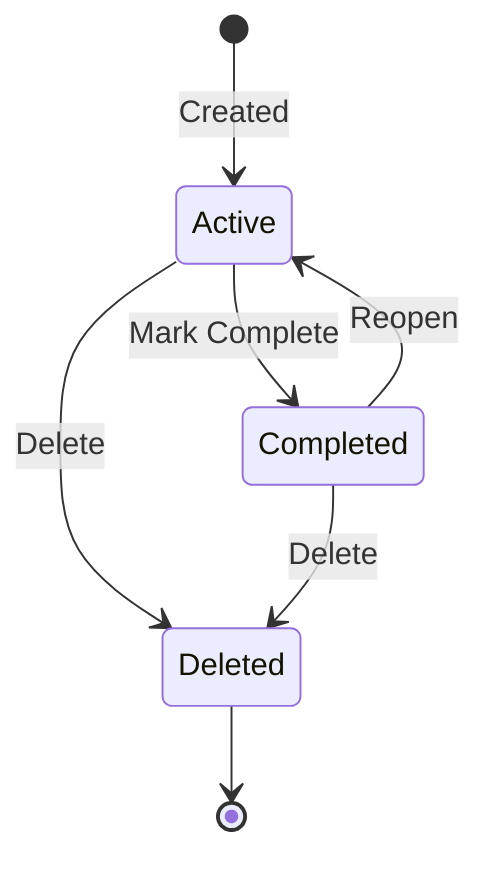

# Implementation Plan: Event-Driven Todo Application with Kafka and Dapr

**Branch**: `004-event-driven-todo` | **Date**: 2026-01-27 | **Spec**: [spec.md](./spec.md)
**Input**: Feature specification from `/specs/004-event-driven-todo/spec.md`

## Summary

Transform the Todo application into a production-grade, event-driven system using Kafka for event streaming and Dapr for cloud-portable service abstractions. The system will support advanced features (recurring tasks, reminders, priorities, tags, search) with deployments to both Minikube (local validation) and Oracle Kubernetes Engine (OKE) for production. All services will communicate via events or Dapr service invocation, with state managed through Dapr State Store, secrets via Dapr Secrets API, and scheduled jobs via Dapr Jobs API. CI/CD automation via GitHub Actions ensures reproducible deployments.

## Technical Context

**Phase 0 Gate**: MCP Context 7 validation REQUIRED before proceeding

**Language/Version**:
- Backend: Python 3.13+ (FastAPI framework with Dapr SDK)
- Frontend: Node.js 18+ / TypeScript (Next.js framework with Dapr SDK)

**Primary Dependencies**:
- **Event Streaming**: Apache Kafka 3.x (via Strimzi operator for self-hosted or Redpanda/Confluent for managed)
- **Service Abstraction**: Dapr 1.12+ (Pub/Sub, State Store, Service Invocation, Secrets, Jobs API)
- **State Store Backend**: Redis 7.x (Phase V choice; PostgreSQL 15+ support deferred to future phase)
- **Container Runtime**: Docker with Dapr sidecar injection
- **Orchestration**: Kubernetes 1.28+ (Minikube for local, OKE for production)
- **CI/CD**: GitHub Actions
- **Observability**: Prometheus + Grafana, Dapr observability

**Storage**:
- Dapr State Store API with Redis 7.x backend (chosen for Phase V due to lower latency and simpler consistency model for todo app; PostgreSQL option deferred)
- Kafka topics for event persistence and replay
- No direct database connections (all via Dapr APIs)

**Testing**:
- Backend: pytest with Dapr test containers
- Frontend: Jest + React Testing Library
- Event Flows: Integration tests with Kafka test containers
- Dapr Components: Component validation with Dapr CLI

**Target Platform**:
- Local: Minikube on developer workstations (macOS/Linux/Windows WSL2)
- Production: Oracle Kubernetes Engine (OKE) on Oracle Cloud Infrastructure (OCI)

**Project Type**: Web application (frontend + backend) with event-driven microservices

**Performance Goals**:
- End-to-end event processing latency: < 2 seconds (95th percentile)
- Concurrent task operations: 100+ without event loss or duplication
- Reminder delivery accuracy: 99%+ within 5 minutes of scheduled time
- Search latency: < 1 second for 1000+ tasks
- Horizontal scalability: N replicas without coordination

**Constraints**:
- At-least-once event delivery guarantee (idempotent handlers required)
- Dapr sidecar startup: < 10 seconds
- Stateless services (all state via Dapr State Store)
- No direct HTTP between services (Dapr service invocation only)
- Cloud portability (no OKE-specific code, only configuration)
- Minikube deployment: < 10 minutes
- Production deployment via CI/CD: < 15 minutes

**Scale/Scope**:
- Users: 10 concurrent (Phase V validation scope)
- Tasks per user: 1000+
- Event throughput: 100 events/second (burst capacity)
- Kafka topics: 4 (todo-created, todo-updated, todo-deleted, todo-reminder)
- Kafka partitions: 3 per topic (production), 1 per topic (local)
- Kafka replication: 3 (production), 1 (local)
- Services: 2 (frontend, backend) + infrastructure (Kafka, Redis, Dapr)

## Constitution Check

*GATE: Must pass before Phase 0 research. Re-check after Phase 1 design.*

### Phase V Constitution Compliance

✅ **I. Spec-Driven Development**: Specification created in spec.md with 8 prioritized user stories and 47 functional requirements. Planning follows MCP Context 7 validation mandate.

✅ **II. Phase-Scoped Development**: Scope limited to event-driven architecture with Kafka and Dapr, deployment to Minikube and OKE. No multi-cloud deployments.

✅ **III. Test-First Event-Driven Validation**: Plan includes TDD approach for events with schema validation, pub/sub tests, and integration tests for Dapr components.

✅ **IV. Minimal Viable Simplicity**: Using Dapr abstractions to avoid custom Kafka clients. No event sourcing or CQRS beyond simple pub/sub. Single Kafka cluster.

✅ **V. Event-Driven State Management**: All state via Dapr State Store API. No direct database connections. Dapr State Store backed by Redis or PostgreSQL.

✅ **VI. Separation of Concerns**: Clear layering: Application code (frontend/backend) → Dapr components (YAML) → Kafka infrastructure → Kubernetes manifests.

✅ **VII. MCP Context-First Development**: Phase 0 requires MCP Context 7 validation for Dapr, Kafka, OKE, GitHub Actions documentation.

✅ **VIII. Dapr-First Service Integration**: All inter-service communication via Dapr Service Invocation or Pub/Sub. No direct HTTP calls.

✅ **IX. Kafka as Event Backbone**: All async communication via Kafka topics. Dapr Pub/Sub configured with Kafka backend.

✅ **X. Stateless Services with Dapr Sidecar Pattern**: Services stateless, sidecars injected via Kubernetes annotations. Idempotent event handlers.

✅ **XI. Production-Grade Kubernetes Focus**: Target OKE for production after Minikube validation. Autoscaling, monitoring, and health checks required.

✅ **XII. CI/CD with GitHub Actions**: Automated deployment pipeline with build, test, validate, deploy, health check, and rollback stages.

✅ **XIII. Secrets Management via Dapr**: All secrets via Dapr Secrets API with Kubernetes Secrets backend.

✅ **XIV. MCP Context Mandate for Implementation**: Blocking gate in Phase 0 for all MCP Context 7 queries.

**Complexity Violations**: None. Architecture follows constitutional principles.

### Quality Gates

**Pre-Phase 0 Gates** (BLOCKING):
- [ ] MCP Context 7 server accessible
- [ ] Dapr documentation retrieved and validated
- [ ] Kafka documentation retrieved and validated
- [ ] OKE documentation retrieved and validated
- [ ] GitHub Actions CI/CD documentation retrieved and validated

**Post-Phase 1 Gates** (BLOCKING):
- [ ] Event schemas defined in JSON Schema format
- [ ] Dapr component YAML files validated
- [ ] Kafka topic configurations documented
- [ ] State transitions modeled for Task entity
- [ ] API contracts defined (if direct HTTP endpoints exist alongside Dapr)

## Project Structure

### Documentation (this feature)

```text
specs/004-event-driven-todo/
├── spec.md                  # Feature specification (created)
├── plan.md                  # This file (/sp.plan output)
├── research.md              # Phase 0 MCP Context research (to be created)
├── data-model.md            # Phase 1 data model and entities (to be created)
├── quickstart.md            # Phase 1 getting started guide (to be created)
├── contracts/               # Phase 1 event schemas and API contracts (to be created)
│   ├── events/
│   │   ├── todo-created.schema.json
│   │   ├── todo-updated.schema.json
│   │   ├── todo-deleted.schema.json
│   │   └── todo-reminder.schema.json
│   └── api/
│       └── (optional REST endpoints if any direct HTTP alongside Dapr)
├── checklists/
│   └── requirements.md      # Quality checklist (created)
└── tasks.md                 # Phase 2 task breakdown (/sp.tasks output - NOT created by /sp.plan)
```

### Source Code (repository root)

```text
# Event-Driven Web Application with Dapr

# Application Services
backend/
├── src/
│   ├── dapr/                # Dapr client integration
│   │   ├── pubsub.py        # Dapr Pub/Sub client
│   │   ├── state.py         # Dapr State Store client
│   │   ├── secrets.py       # Dapr Secrets client
│   │   └── jobs.py          # Dapr Jobs API client
│   ├── events/              # Event handlers and publishers
│   │   ├── publishers.py    # Publish events to Kafka via Dapr
│   │   ├── subscribers.py   # Subscribe to events from Kafka via Dapr
│   │   └── schemas.py       # Event schema validation
│   ├── api/                 # HTTP endpoints (Dapr service invocation)
│   │   ├── tasks.py         # Task CRUD endpoints
│   │   ├── search.py        # Search and filter endpoints
│   │   └── reminders.py     # Reminder management endpoints
│   ├── services/            # Business logic (domain services)
│   │   ├── task_service.py  # Task management business logic
│   │   ├── reminder_service.py # Reminder scheduling logic
│   │   └── search_service.py   # Search and filter logic
│   └── models/              # Domain models (not database models)
│       ├── task.py          # Task domain model
│       └── event.py         # Event domain model
└── tests/
    ├── integration/
    │   ├── test_event_flows.py  # End-to-end event tests
    │   └── test_dapr_components.py # Dapr component tests
    ├── unit/
    │   ├── test_task_service.py
    │   └── test_event_handlers.py
    └── contract/
        └── test_event_schemas.py

frontend/
├── src/
│   ├── dapr/                # Dapr client integration (JavaScript/TypeScript)
│   │   ├── serviceinvocation.ts # Dapr service invocation client
│   │   └── pubsub.ts        # Optional: Dapr Pub/Sub client for frontend
│   ├── components/          # React components
│   │   ├── TaskList.tsx
│   │   ├── TaskForm.tsx
│   │   ├── SearchFilter.tsx
│   │   └── ReminderSettings.tsx
│   ├── pages/               # Next.js pages
│   │   ├── index.tsx
│   │   └── tasks/[id].tsx
│   └── services/            # Frontend service layer
│       ├── taskService.ts   # Task API calls via Dapr
│       └── searchService.ts # Search API calls via Dapr
└── tests/
    ├── integration/
    └── unit/

# Dapr Component Definitions (Phase V Infrastructure)
dapr/
├── components/
│   ├── pubsub-kafka.yaml         # Kafka Pub/Sub component
│   ├── statestore-redis.yaml     # Redis State Store component
│   ├── secrets-kubernetes.yaml   # Kubernetes Secrets component
│   └── serviceinvocation.yaml    # Service invocation config (if needed)
└── subscriptions/
    ├── backend-subscriptions.yaml # Backend event subscriptions
    └── (frontend-subscriptions.yaml - optional)

# Kafka Infrastructure
kafka/
├── topics/                   # Topic definitions and schemas
│   ├── todo-created.yaml     # Kafka topic configuration
│   ├── todo-updated.yaml
│   ├── todo-deleted.yaml
│   └── todo-reminder.yaml
└── strimzi/                  # Strimzi Kafka operator manifests (if self-hosted)
    └── kafka-cluster.yaml

# Helm Charts (Phase V Deployment)
helm/
├── todo-app-event-driven/
│   ├── Chart.yaml
│   ├── values.yaml           # Default values
│   ├── values-minikube.yaml  # Minikube-specific overrides
│   ├── values-oke.yaml       # OKE-specific overrides
│   └── templates/
│       ├── deployment-frontend.yaml   # With Dapr sidecar annotations
│       ├── deployment-backend.yaml    # With Dapr sidecar annotations
│       ├── service-frontend.yaml
│       ├── service-backend.yaml
│       ├── configmap.yaml
│       ├── secret.yaml
│       ├── dapr-components/           # Dapr component manifests
│       │   ├── pubsub.yaml
│       │   ├── statestore.yaml
│       │   └── secrets.yaml
│       └── kafka/                     # Kafka cluster manifests (if Strimzi)
│           └── kafka.yaml

# CI/CD (Phase V Automation)
.github/
└── workflows/
    ├── deploy-minikube.yaml          # Local validation deployment
    ├── deploy-oke-production.yaml    # OKE production deployment
    ├── test-event-flows.yaml         # Event integration tests
    └── build-and-push-images.yaml    # Docker image builds

# Monitoring and Observability
monitoring/
├── prometheus-values.yaml            # Prometheus Helm values
├── grafana-values.yaml               # Grafana Helm values
├── servicemonitor-dapr.yaml          # Dapr metrics ServiceMonitor
├── fluent-bit-values.yaml            # Fluent Bit logging configuration
└── grafana-dashboards/               # Custom Grafana dashboards
    ├── event-flows.json              # Event flow metrics dashboard
    └── task-service.json             # Task service metrics dashboard

# Documentation
docs/
├── event-architecture.md             # Event flow diagrams and design
├── dapr-components.md                # Dapr component documentation
├── kafka-topics.md                   # Topic schemas and conventions
├── oke-deployment.md                 # OKE cluster setup and deployment
└── local-development.md              # Minikube local development guide
```

**Structure Decision**: Web application structure chosen based on frontend (Next.js) and backend (FastAPI) services. Event-driven architecture layer added with Dapr components and Kafka infrastructure. All application code uses Dapr SDKs for service interactions. Infrastructure defined declaratively in Helm charts and Dapr component YAML files.

## Complexity Tracking

> **No constitutional violations identified. All complexity justified below.**

| Complexity Introduced | Why Needed | Simpler Alternative Rejected Because |
|----------------------|------------|-------------------------------------|
| Event-Driven Architecture with Kafka | Constitution Principle XIX mandates event-driven approach. Enables loose coupling, horizontal scaling, and audit trail. | Direct synchronous API calls would tightly couple services, prevent independent scaling, and lose event history for debugging. |
| Dapr Sidecar Pattern | Constitution Principle XX mandates Dapr sidecars. Provides cloud portability, eliminates custom SDK integration. | Direct Kafka SDK usage would couple application to Kafka implementation, preventing cloud portability and requiring custom retry/circuit breaker logic. |
| Dual Deployment Targets (Minikube + OKE) | Constitution Principle XXV requires production Kubernetes after local validation. Minikube validates locally, OKE provides production scalability. | Cloud-only deployment would slow development cycles and increase debugging costs. Local-only would not validate production scenarios. |
| Dapr Jobs API for Reminders | Functional requirement FR-013 mandates Dapr Jobs API for scheduled reminders. Provides at-least-once guarantee and automatic retry. | Cron jobs or in-memory schedulers would lose state on pod restarts and lack automatic retry mechanisms. |

## Phase 0: MCP Context Validation & Research

### Objectives

1. Validate MCP Context 7 server availability
2. Fetch and validate official documentation for all Phase V technologies
3. Resolve all technical unknowns and architecture decisions
4. Document best practices and design patterns
5. Create research.md with findings

### MCP Context 7 Validation Tasks

**BLOCKING GATE**: Cannot proceed to Phase 1 without successful completion of ALL MCP Context queries.

#### Required MCP Context Queries

1. **Dapr Pub/Sub API Documentation**
   - Query: "Dapr Pub/Sub API with Kafka backend - configuration, subscription handling, and best practices"
   - Expected Output: Pub/Sub component YAML structure, subscription declarative configuration, at-least-once delivery guarantees
   - Validation: Can create pubsub-kafka.yaml component and subscription YAML files

2. **Dapr State Store API Documentation**
   - Query: "Dapr State Store API with Redis backend - configuration, concurrency control, and ETags"
   - Expected Output: State Store component YAML, get/set/delete operations, optimistic locking with ETags
   - Validation: Can create statestore-redis.yaml and implement state operations

3. **Dapr Service Invocation Documentation**
   - Query: "Dapr Service Invocation between services in Kubernetes - app-id, method invocation, and retries"
   - Expected Output: Service invocation syntax, app-id annotation requirements, automatic service discovery
   - Validation: Can invoke backend from frontend via Dapr without direct HTTP

4. **Dapr Secrets API Documentation**
   - Query: "Dapr Secrets API with Kubernetes Secrets backend - secret retrieval and rotation"
   - Expected Output: Secrets component YAML for Kubernetes backend, secret retrieval API
   - Validation: Can create secrets-kubernetes.yaml and retrieve secrets at runtime

5. **Dapr Jobs API Documentation**
   - Query: "Dapr Jobs API for scheduled tasks - job scheduling, cancellation, and retry logic"
   - Expected Output: Jobs API syntax for scheduling recurring and one-time jobs, cancellation methods
   - Validation: Can schedule reminder jobs with cancellation support

6. **Kafka Topic Configuration Best Practices**
   - Query: "Apache Kafka topic configuration for event-driven microservices - partitions, replication, retention"
   - Expected Output: Recommended partition counts, replication factors, retention policies for event streams
   - Validation: Can configure topics with appropriate partitioning and retention

7. **Kafka Consumer Groups and Idempotency**
   - Query: "Kafka consumer groups for at-least-once delivery and idempotent event handlers"
   - Expected Output: Consumer group best practices, offset management, idempotency patterns
   - Validation: Can implement idempotent event handlers to prevent duplicate processing

8. **Kubernetes Dapr Sidecar Injection**
   - Query: "Dapr sidecar injection in Kubernetes pods - annotations, ports, and health checks"
   - Expected Output: Required pod annotations (dapr.io/enabled, dapr.io/app-id, dapr.io/app-port), sidecar lifecycle
   - Validation: Can deploy pods with Dapr sidecars injected automatically

9. **Oracle Kubernetes Engine (OKE) Setup and Configuration**
   - Query: "Oracle Kubernetes Engine cluster provisioning and configuration for production workloads"
   - Expected Output: OKE cluster creation, node pool configuration, OCI integration, networking
   - Validation: Can provision OKE cluster with required resources

10. **GitHub Actions CI/CD for Kubernetes Deployments**
    - Query: "GitHub Actions workflow for building Docker images and deploying to Kubernetes with Helm"
    - Expected Output: Workflow YAML structure, Docker build/push actions, Helm deployment steps, health checks
    - Validation: Can create CI/CD pipeline for automated deployments

11. **Strimzi Kafka Operator for Kubernetes** (if self-hosted Kafka)
    - Query: "Strimzi Kafka operator installation and Kafka cluster configuration on Kubernetes"
    - Expected Output: Strimzi operator installation, Kafka cluster CRD, topic management
    - Validation: Can deploy self-hosted Kafka cluster on Minikube

12. **Prometheus and Grafana for Dapr Observability**
    - Query: "Prometheus metrics collection from Dapr sidecars and Grafana dashboards for Dapr observability"
    - Expected Output: Dapr metrics endpoints, Prometheus scrape configuration, pre-built Grafana dashboards
    - Validation: Can monitor Dapr sidecars and event flows

### Research Questions to Answer

**Event Architecture Design**:
- How should event schemas evolve (versioning strategy)?
- What partition key should be used for todo events (userId, todoId, or composite)?
- How to handle event schema validation failures (dead letter queue)?
- What retention period for Kafka topics (7 days default, configurable)?

**Dapr Component Configuration**:
- Redis vs PostgreSQL for Dapr State Store (performance, consistency trade-offs)?
- Dapr Jobs API support for recurring jobs (daily, weekly, monthly intervals)?
- Dapr component scoping (namespace-scoped vs cluster-scoped)?
- Dapr sidecar resource limits (CPU, memory) for production?

**Deployment Strategy**:
- Minikube resource requirements (CPU, RAM) for full stack?
- OKE node pool sizing and autoscaling configuration?
- Self-hosted Kafka (Strimzi) vs managed Kafka (Redpanda Cloud/Confluent) decision?
- Helm chart strategy for environment-specific values (values-minikube.yaml, values-oke.yaml)?

**Observability and Monitoring**:
- Dapr distributed tracing with OpenTelemetry?
- Kafka lag monitoring and alerting thresholds?
- Event flow visualization tools (Dapr dashboard, Kafka UI)?

### Expected Outputs (Phase 0)

**File: `specs/004-event-driven-todo/research.md`**

Structure:
```markdown
# Research: Event-Driven Todo with Kafka and Dapr

## MCP Context 7 Validation Results

### 1. Dapr Pub/Sub API
- **Status**: ✅ Validated
- **Documentation Version**: [from MCP]
- **Key Findings**: [component YAML structure, subscription patterns]
- **Decision**: [configuration choices]

[Repeat for all 12 MCP Context queries]

## Architecture Decisions

### Event Schema Versioning
- **Decision**: [chosen strategy]
- **Rationale**: [why chosen]
- **Alternatives Considered**: [what else evaluated]

### Kafka Partition Strategy
- **Decision**: Partition by todoId
- **Rationale**: Ensures ordering guarantees for events related to same todo
- **Alternatives Considered**: Partition by userId (would couple all user events to single partition)

[Continue for all research questions]

## Technology Choices

### State Store Backend
- **Decision**: Redis for State Store
- **Rationale**: Lower latency, simpler consistency model for todo app
- **Alternatives Considered**: PostgreSQL (higher latency, better for complex queries)

### Kafka Deployment
- **Decision**: Strimzi for Minikube, Redpanda Cloud for OKE
- **Rationale**: Self-hosted for local control, managed for production simplicity
- **Alternatives Considered**: Confluent Cloud (higher cost), Strimzi for both (operational overhead)

[Continue for all technology choices]

## Best Practices Identified

- Dapr sidecar injection via annotations
- Idempotent event handlers with deduplication keys
- Kafka consumer group per service
- Event schema validation before publishing
- Health checks for Dapr sidecar readiness
- Graceful shutdown with in-flight event processing

## Risks and Mitigations

| Risk | Impact | Mitigation |
|------|--------|-----------|
| Dapr sidecar startup delays | Pods fail health checks | Increase initialDelaySeconds for readiness probe |
| Kafka topic creation lag | Events published before topic exists | Pre-create topics in deployment scripts |
| Event schema evolution breaking consumers | Service failures on deployment | Use backward-compatible schema changes only |
```

## Phase 1: Design & Contracts

### Objectives

1. Define domain data models and entities
2. Create event schemas (JSON Schema format)
3. Document state transitions for Task entity
4. Define API contracts (if direct HTTP endpoints exist)
5. Create quickstart guide for local development
6. Update agent context with Phase V technologies

### Phase 1 Artifacts

#### File: `specs/004-event-driven-todo/data-model.md`

```markdown
# Data Model: Event-Driven Todo Application

## Domain Entities

### Task
**Purpose**: Represents a todo item with extended attributes for Phase V features

**Attributes**:
- `id`: UUID (unique identifier)
- `title`: string (max 200 chars, required)
- `description`: string (max 2000 chars, optional)
- `completed`: boolean (default: false)
- `priority`: enum [High, Medium, Low] (default: Medium)
- `tags`: array of strings (max 50 tags, each max 50 chars)
- `dueDate`: ISO8601 timestamp (optional)
- `recurring`: boolean (default: false)
- `recurrenceInterval`: enum [daily, weekly, monthly] (required if recurring=true)
- `createdAt`: ISO8601 timestamp (auto-generated)
- `updatedAt`: ISO8601 timestamp (auto-updated)
- `userId`: string (required, from auth context)

**Validation Rules**:
- title must not be empty
- tags must be unique within task
- dueDate must be in future (if set)
- recurrenceInterval required if recurring=true
- maximum 50 tags per task

**State Transitions**:


### ReminderJob
**Purpose**: Scheduled reminder for task due dates

**Attributes**:
- `jobId`: UUID (unique identifier)
- `todoId`: UUID (foreign key to Task)
- `scheduledTime`: ISO8601 timestamp
- `status`: enum [pending, executed, cancelled]

**Lifecycle**: Created when dueDate set, cancelled when task completed/deleted

### Event
**Purpose**: Domain event for event-driven communication

**Attributes**:
- `eventId`: UUID (deduplication key)
- `eventType`: enum [todo-created, todo-updated, todo-deleted, todo-reminder]
- `timestamp`: ISO8601 timestamp
- `todoId`: UUID
- `userId`: string
- `payload`: object (event-specific data)

## Event Schemas

See `contracts/events/` for JSON Schema definitions.

## Relationships

- Task → ReminderJob: One-to-Many (one task can have multiple reminder jobs for recurring tasks)
- Event → Task: Many-to-One (many events reference one task)
```

#### Files: `specs/004-event-driven-todo/contracts/events/*.schema.json`

**File: `todo-created.schema.json`**
```json
{
  "$schema": "http://json-schema.org/draft-07/schema#",
  "title": "TodoCreatedEvent",
  "type": "object",
  "required": ["eventId", "eventType", "timestamp", "todoId", "userId", "payload"],
  "properties": {
    "eventId": {
      "type": "string",
      "format": "uuid",
      "description": "Unique event identifier for idempotency"
    },
    "eventType": {
      "type": "string",
      "enum": ["todo-created"]
    },
    "timestamp": {
      "type": "string",
      "format": "date-time"
    },
    "todoId": {
      "type": "string",
      "format": "uuid"
    },
    "userId": {
      "type": "string"
    },
    "payload": {
      "type": "object",
      "required": ["title"],
      "properties": {
        "title": {"type": "string", "minLength": 1, "maxLength": 200},
        "description": {"type": "string", "maxLength": 2000},
        "priority": {"type": "string", "enum": ["High", "Medium", "Low"]},
        "tags": {"type": "array", "items": {"type": "string"}},
        "dueDate": {"type": "string", "format": "date-time"},
        "recurring": {"type": "boolean"},
        "recurrenceInterval": {"type": "string", "enum": ["daily", "weekly", "monthly"]}
      }
    }
  }
}
```

[Similar schemas for todo-updated, todo-deleted, todo-reminder]

#### File: `specs/004-event-driven-todo/quickstart.md`

```markdown
# Quickstart: Local Development with Minikube

## Prerequisites

- Minikube installed (v1.32+)
- Docker Desktop running
- kubectl installed
- Helm 3.12+ installed
- Dapr CLI installed

## Step 1: Start Minikube

```bash
minikube start --cpus=4 --memory=8g
```

## Step 2: Install Dapr Control Plane

```bash
dapr init --kubernetes --wait
```

## Step 3: Deploy Kafka (Strimzi)

```bash
kubectl create namespace kafka
kubectl apply -f kafka/strimzi/kafka-cluster.yaml -n kafka
kubectl wait kafka/my-cluster --for=condition=Ready --timeout=300s -n kafka
```

## Step 4: Deploy Redis for State Store

```bash
helm install redis bitnami/redis --set auth.enabled=false
```

## Step 5: Deploy Dapr Components

```bash
kubectl apply -f dapr/components/
kubectl apply -f dapr/subscriptions/
```

## Step 6: Deploy Application via Helm

```bash
helm install todo-app ./helm/todo-app-event-driven -f helm/todo-app-event-driven/values-minikube.yaml
```

## Step 7: Access Application

```bash
minikube service todo-app-frontend --url
```

## Step 8: Validate Event Flows

```bash
# Create a task via frontend
# Check backend logs for event consumption
kubectl logs -l app=backend --tail=100 -f

# Check Kafka topics
kubectl exec -it my-cluster-kafka-0 -n kafka -- bin/kafka-console-consumer.sh \
  --bootstrap-server localhost:9092 \
  --topic todo-created \
  --from-beginning
```

## Cleanup

```bash
helm uninstall todo-app
helm uninstall redis
kubectl delete -f kafka/strimzi/kafka-cluster.yaml -n kafka
dapr uninstall --kubernetes
minikube delete
```
```

### Agent Context Update

**Task**: Run `.specify/scripts/bash/update-agent-context.sh claude` to update `CLAUDE.md` with Phase V technologies.

**Additions to Active Technologies**:
- Dapr 1.12+ (Pub/Sub, State Store, Service Invocation, Secrets, Jobs API)
- Apache Kafka 3.x (via Strimzi operator or Redpanda Cloud)
- Redis 7.x (Dapr State Store backend)
- Oracle Kubernetes Engine (OKE) for production deployment
- GitHub Actions for CI/CD automation
- Prometheus + Grafana for observability

**Additions to Recent Changes**:
- 004-event-driven-todo: Event-driven architecture with Kafka and Dapr, deployment to Minikube and OKE, CI/CD with GitHub Actions

## Post-Phase 1 Constitution Re-Check

After completing Phase 1 design artifacts, re-validate constitutional compliance:

✅ **Event schemas defined**: JSON Schema files in contracts/events/
✅ **Dapr components validated**: Component YAML structure confirmed via MCP Context
✅ **Kafka topic configurations documented**: Partition and retention settings in research.md
✅ **State transitions modeled**: Task entity state machine in data-model.md
✅ **API contracts defined**: Event schemas serve as contracts for async communication

**Gate Status**: ✅ PASSED - Ready for `/sp.tasks` command to generate Phase 2 task breakdown

## Next Steps

1. **Complete Phase 0**: Run MCP Context 7 queries and create research.md
2. **Complete Phase 1**: Create data-model.md, event schemas, and quickstart.md
3. **Run `/sp.tasks`**: Generate actionable task breakdown from this plan
4. **Implement via `/sp.implement`**: Execute tasks with TDD approach for event flows

---

**Plan Status**: Draft - Awaiting Phase 0 MCP Context validation
**Author**: Claude Code (Spec-Driven Development workflow)
**Last Updated**: 2026-01-27
